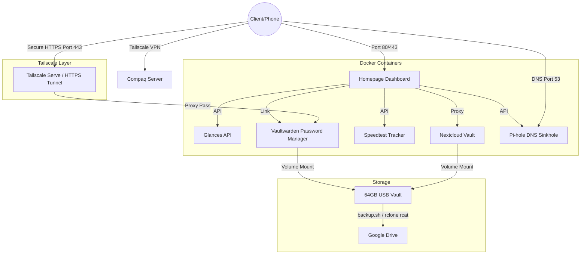

# Command Center | Self-Hosted Dashboard

A lightweight, containerized dashboard built for resource-efficient management of self-hosted services. Designed for deployment on vintage hardware (Compaq) with a focus on Infrastructure as Code (IaC) principles.

## 📚 Documentation
For detailed system administration and recovery procedures, refer to the included playbooks:
* [Infrastructure Map & Startup Sequencing](docs/infrastructure-map.md)
* [Docker Compose Blueprint](docs/docker-compose-blueprint.md)
* [Disaster Recovery Playbook](docs/disaster-recovery-playbook.md)
* [Secrets Management](docs/secrets-and-configuration-management.md)

## 🏗️ Architecture Diagram



## 🚀 Features
* **Resource Optimized:** Telemetry via headless Glances API, minimizing overhead on legacy hardware.
* **Infrastructure as Code:** Fully deployable stack using Docker Compose.
* **Secure Access:** Network layer secured via Tailscale, sensitive configurations handled via environment variables.
* **Automated Analytics:** Continuous background network monitoring and historical bandwidth graphing via Speedtest Tracker.
* **Network-Wide Ad Blocking:** Pi-hole intercepts telemetry and malicious domains at the DNS level.
* **Zero-Storage Backups:** Custom `backup.sh` streams compressed volume archives directly to Google Drive via `rclone`, bypassing limited local disk space.
* **Zero-Knowledge Password Management:** Self-hosted Vaultwarden instance syncing encrypted passwords securely across client devices.

## 🛠️ Tech Stack
* **Orchestration:** Docker Compose
* **Dashboard Platform:** Homepage(Liscened under GPL-3.0)
* **Monitoring:** Glances
* **Connectivity:** Tailscale
* **Network Analytics:** Speedtest Tracker
* **Credential Management:** Vaultwarden (Rust-based Bitwarden API implementation)
* **DNS & Ad-Blocking:** Pi-hole
* **Backup Streaming:** Rclone

## ⚙️ Deployment
1. Clone the repository:
```bash
git clone https://github.com/TingRongYou/self-hosted-command-center.git
```
2. Configure Secrets:
Copy the example and populate your environment variables:
```bash
cp homepage/config/secrets.env.example homepage/config/secrets.env
nano homepage/config/secrets.env
```
3. Expose Vaultwarden over Tailscale HTTPS:
Ensure MagicDNS and HTTPS Certificates are enabled in your Tailscale Admin Console, then initialize the background secure proxy on the host machine:
```bash
sudo tailscale serve --bg http://127.0.0.1:8083
```
4. Configure Startup Dependencies:
Ensure the custom `systemd` override is applied so Docker waits for the USB mount, preventing local storage exhaustion. (See Infrastructure Map documentation)
5. Deploy:
```bash
sudo docker compose up -d
```

## 🛡️ Security
This project is designed for private, self-hosted environments. 
- No public web exposure of services.
- Sensitive environment variables are managed locally via `secrets.env` and excluded from source control.
- Tailscale is recommended for secure, remote access.
- **SSL/TLS Requirement:** Vaultwarden's core cryptographic primitives are protected by enforcing strict end-to-end HTTPS utilizing automated Tailscale Let's Encrypt certificates, preventing plain-text credential leaks over the local network.
## ⚖️ Licensing & Credits
* This project utilizes the [Homepage](https://github.com/gethomepage/homepage.git) platform, which is licensed under the **GNU General Public License v3.0**.
* Architecture design and custom CSS overrided.
* Credential backend powered by [Vaultwarden](https://github.com/dani-garcia/vaultwarden), licensed under the **GNU General Public License v3.0**.
